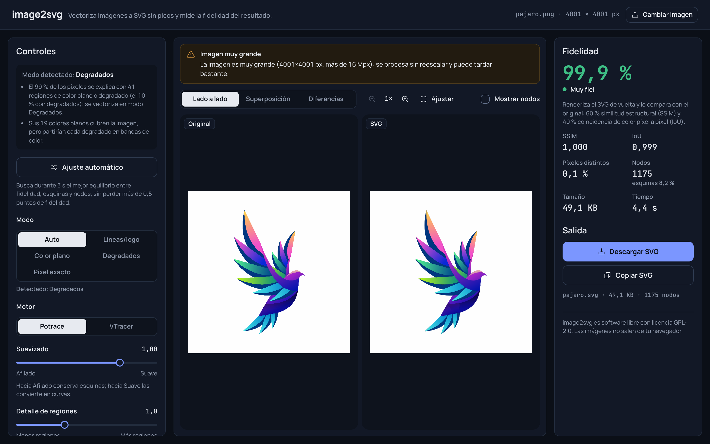
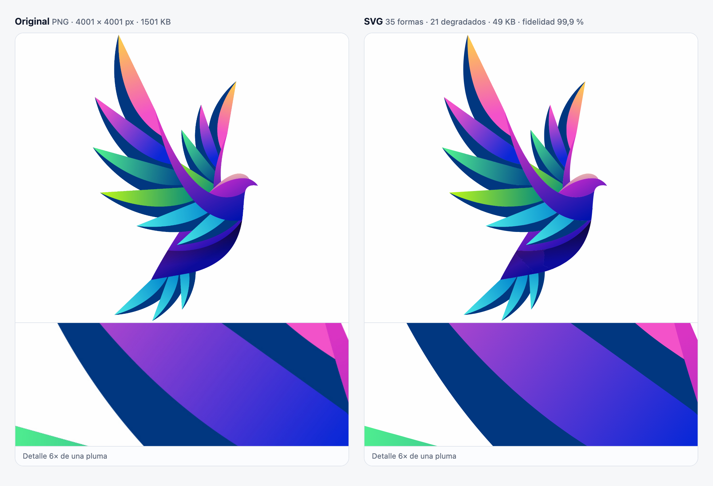

# image2svg

[](https://github.com/Luizun777/image2svg/actions/workflows/ci.yml)
[](LICENSE)

Vectoriza imágenes raster (PNG, JPG, WebP, GIF o BMP) a SVG en el navegador y mide la fidelidad del resultado; la imagen
no sale de tu equipo.

**Demo:** [image2svg-ashy.vercel.app](https://image2svg-ashy.vercel.app/)



Los "picos" (dientes de sierra) aparecen cuando el trazador sigue tal cual la escalera de píxeles del
borde. image2svg la elimina antes de trazar: reescala la imagen hasta 4× con un bicúbico sin sobreimpulso, la suaviza con un
desenfoque gaussiano proporcional al reescalado y la binariza en el nivel del 50 % de cobertura, así Potrace recibe un borde
continuo en lugar de escalones (la receta de `mkbitmap`). Después renderiza el SVG, lo compara con el original (SSIM, IoU,
píxeles distintos) y muestra un mapa de diferencias.

## De imagen a SVG



Ese logo pasa de un PNG de 4001 × 4001 px y 1,5 MB a un SVG de 49 KB con 35 formas y 21 degradados lineales, con una
fidelidad medida del 99,9 %. En el detalle al 6× cada pluma conserva su degradado en lugar de partirse en bandas de color.

## Modos

| Modo | Para qué | Cómo se traza |
| --- | --- | --- |
| **Auto** | Cualquier imagen | Analiza la paleta, los bordes, los degradados y la rejilla, elige uno de los cuatro modos siguientes y explica por qué. Va a Degradados la imagen cuyas formas se explican con colores planos y degradados: sin paleta exacta, o con una paleta exacta de 8 colores o más si además tiene degradados (como un logo con plumas en rampa, cuya rampa deja una escalera de colores). Si no tiene paleta exacta y tampoco se explica así, se trata como foto y se avisa. |
| **Líneas / logo** | Dibujos a línea, logos de un color, escaneos | Reescalado, desenfoque, umbral de iso-nivel (o la transparencia como máscara) y un único trazado relleno. |
| **Color plano** | Ilustraciones y logos con pocos colores | Paleta exacta (o reducida si la imagen tiene demasiados colores), una máscara por color y capas apiladas sin costuras. |
| **Degradados** | Logos e ilustraciones con degradados (plumas, iconos con brillo, fondos en rampa) | Divide la imagen en formas por sus bordes (laplaciano y Sobel con histéresis, umbrales según el ruido), ajusta a cada forma un color plano, un degradado lineal o uno radial con hasta 8 paradas, y emite cada forma como un trazado recortado con su propio `<linearGradient>` o `<radialGradient>`, editable. Si la imagen es casi toda borde, como una foto, la traza en Color plano con 16 colores y avisa. |
| **Píxel exacto** | Pixel art | Detecta la rejilla y emite rectángulos fusionados, sin pérdida y con `crispEdges`. |

- **Motores:** Potrace (principal) y VTracer. Si uno no se puede cargar se usa el otro y se avisa.
- **Ajuste automático:** durante 3 s, en un segundo worker, prueba combinaciones de reescalado, desenfoque, suavizado,
  tolerancia de curva y manchas mínimas (primero sobre una versión reducida si la imagen es grande) y compara con VTracer. Se
  queda con el mejor equilibrio entre fidelidad, esquinas y nodos sin perder más de 0,5 puntos de fidelidad frente a los
  parámetros de partida. Al aplicarlo muestra fidelidad, esquinas, nodos y tamaño antes y después, y qué parámetros cambió.
  Muestra el progreso y se puede cancelar. En Degradados, la segmentación y los degradados ajustados se calculan una vez y
  sirven para todas las combinaciones.
- **Avisos:** parece una foto, trazos finos, demasiados rectángulos, reescalado limitado, entrada grande, motor no disponible,
  trazado vacío, transparencia falsa y degradados no reconstruidos, cada uno con su acción sugerida. Si una imagen que parece
  foto tiene formas que se explican con degradados, el aviso ofrece **Usar degradados**.
- **Salida:** descargar o copiar el SVG, opcionalmente optimizado con SVGO (conserva los `<defs>` y los ids de los
  degradados).

Límites: cada lado de la imagen hasta 4096 px; el reescalado interno no pasa de 16 megapíxeles. Las fotos se posterizan (y
se avisa); los degradados de logos e ilustraciones se reconstruyen como degradados SVG en el modo Degradados.

## Degradados

Cada forma de la imagen (una pluma, un brillo, una sombra) sale como un único trazado con su propio relleno: color plano,
`<linearGradient>` o `<radialGradient>`, en unidades del `viewBox` (`gradientUnits="userSpaceOnUse"`, sin
`gradientTransform`), así que se edita en Figma, Illustrator o Inkscape como cualquier degradado. Las capas son
**Recortadas** por defecto para que cada forma tenga su degradado; **Apiladas** también funciona.

- **Detalle de regiones:** cuánto separa dos zonas de color parecido; más alto encuentra más formas.
- **Paradas máximas:** colores por degradado, de 2 a 8. Un degradado de dos colores usa dos aunque el máximo sea mayor.
- **Degradados radiales:** permite degradados circulares además de los lineales.

Si la imagen es casi toda borde (una foto, ruido) o se divide en más de 2000 regiones, no hay degradados que reconstruir:
se traza en Color plano con 16 colores y el aviso **Degradados no reconstruidos** lo explica.

## Transparencia falsa (tablero pintado)

Muchas imágenes que se descargan como "PNG transparente" son opacas: llevan pintado el tablero de ajedrez gris y blanco con
el que los editores indican la transparencia. image2svg lo detecta en el borde de la imagen (también si se reescaló y sus
cuadros ya no miden un número entero de píxeles) y, por defecto, lo trata como fondo transparente: no genera capas grises de
fondo y la fidelidad se mide contra la imagen sin el tablero. Un aviso lo explica.

- **Mantener el tablero**, en el aviso o en **Avanzado > Trazado > Fondo de tablero pintado**, lo traza como parte del diseño
  y lo mide contra los píxeles tal cual. Líneas/logo traza un solo color y no puede reproducir un tablero de dos tonos, así
  que desde ese modo el aviso ofrece **Mantener el tablero en Color plano**. **Tratar como transparente** vuelve al
  comportamiento por defecto.
- La vista **Original** muestra siempre los píxeles reales, con su tablero pintado. La vista **SVG** pone debajo el tablero
  propio de la app (cuadros de 8 px), así se ve qué quedó transparente.

## Uso en local

Requisitos: Node 26 y npm.

```bash
npm install
npm run dev         # http://localhost:5173/image2svg/
npm test            # tests con vitest
npm run typecheck   # app, worker y tests
npm run build       # genera dist/
npm run preview     # sirve dist/ en http://localhost:4173/image2svg/
```

En desarrollo, `?synth=circle`, `line`, `glyph`, `flat`, `sprite`, `logo`, `gradient` (plumas con degradado lineal) o `radial`
(disco con degradado radial) carga una imagen sintética sin necesidad de archivo.

### Bench con imágenes reales

Las imágenes de prueba no están en el repositorio (`img/` y `samples/` están en `.gitignore`). Copia los originales a `img/`,
conviértelos a PNG en `samples/` (macOS, usa `sips`) y lanza el bench:

```bash
./scripts/prepare-samples.sh
BENCH=1 npx vitest run tests/bench
```

Sin `BENCH=1` el bench se salta. Cada muestra necesita su suelo medido en la tabla `MEASURED` de
`tests/bench/realImages.test.ts`: una imagen nueva sin esa entrada hace fallar el bench.

Los contratos entre módulos y las decisiones de implementación (con sus mediciones) están en `ARCHITECTURE.md`; el sistema
visual, en `DESIGN.md`.

## Despliegue

El demo está en Vercel: [image2svg-ashy.vercel.app](https://image2svg-ashy.vercel.app/). Se actualiza con cada push a
`main`.

`vercel.json` compila con `vite build --base=/`, porque Vercel sirve desde la raíz del dominio, mientras que
`vite.config.ts` mantiene `base: '/image2svg/'` para servir la app bajo una subruta. Para desplegar a mano:

```bash
npx vercel login && npx vercel --prod
```

Cada push a `main` ejecuta `.github/workflows/ci.yml` (`npm ci`, `npm run typecheck`, `npm test`, `npm run build`).

## Licencias

- **image2svg:** GPL-2.0 (ver `LICENSE`), obligada por `esm-potrace-wasm` (Potrace compilado a WebAssembly, GPL-2.0), que va
  dentro del worker de trazado.
- **vtracer-web:** MIT.
- **SVGO** (optimización opcional, se carga solo cuando se usa): MIT.
- **Manrope** (`@fontsource-variable/manrope`, autoalojada): SIL Open Font License 1.1.
- **JetBrains Mono** (`@fontsource-variable/jetbrains-mono`, autoalojada): SIL Open Font License 1.1.
- **Phosphor Icons** (`@phosphor-icons/core`): MIT.
